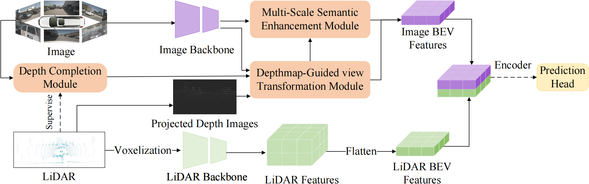

# DG-BEV: Depth-Guided BEV 3D Object Detection with Sparse LiDAR Data

Sihan Chen , Keqiu Wang , Yadong Wang , Tianyu Shen , and Kunfeng Wang* (*Corresponding authors)

27th IEEE International Conference on Intelligent Transportation Systems (ITSC) (ITSC 2024)
 In the field of autonomous driving, Bird’s Eye View (BEV) technology has garnered significant attention due
to its excellent utilization of multi-view multi-modal data. However, current BEV detection frameworks still encounter
challenges arising from insufficient incorporation of image semantic information and the sparsity of LiDAR data. This paper introduces a depth-guided BEV (DG-BEV) 3D detection method comprising a depth-guided view Transformation module (DG-VTM) and a visual-based depth completion module, enabling mitigating the limitations of sparse LiDAR data and enhancing the overall perception. Additionally, a multi-scale semantic enhancement module (MSEM) is proposed to ensure holistic and nuanced integration of semantic details into the detection process. The DG-VTM and MSEM are seamlessly incorporated as a plug-and-play unit, making it adaptable for integration into various BEV detection models. In experiments conducted on the nuScenes validation dataset, DG-BEV reaches an NDS of 71.87%, exceeding several state-of-the-art methods.

## Framework Overview


The overall architecture of our proposed DG-BEV.

## Install

### Environment

The code is built with following libraries:

- Python >= 3.8, \<3.9
- OpenMPI = 4.0.4 and mpi4py = 3.0.3 (Needed for torchpack)
- Pillow = 8.4.0 (see [here](https://github.com/mit-han-lab/bevfusion/issues/63))
- [PyTorch](https://github.com/pytorch/pytorch) >= 1.9, \<= 1.10.2
- [tqdm](https://github.com/tqdm/tqdm)
- [torchpack](https://github.com/mit-han-lab/torchpack)
- [mmcv](https://github.com/open-mmlab/mmcv) = 1.4.0
- [mmdetection](http://github.com/open-mmlab/mmdetection) = 2.20.0
- [nuscenes-dev-kit](https://github.com/nutonomy/nuscenes-devkit)
- Please follow the instructions from [here]([mit-han-lab/bevfusion: [ICRA'23\] BEVFusion: Multi-Task Multi-Sensor Fusion with Unified Bird's-Eye View Representation (github.com)](https://github.com/mit-han-lab/bevfusion/tree/main)) to finish the process

### nuScenes

Please follow the instructions from [here](https://github.com/open-mmlab/mmdetection3d/blob/master/docs/en/datasets/nuscenes_det.md) to download and preprocess the nuScenes dataset. Please remember to download both detection dataset and the map extension (for BEV map segmentation). After data preparation, you will be able to see the following directory structure (as is indicated in mmdetection3d):

```
mmdetection3d
├── mmdet3d
├── tools
├── configs
├── data
│   ├── nuscenes
│   │   ├── maps
│   │   ├── samples
│   │   ├── sweeps
│   │   ├── v1.0-test
|   |   ├── v1.0-trainval
│   │   ├── nuscenes_database
│   │   ├── nuscenes_infos_train.pkl
│   │   ├── nuscenes_infos_val.pkl
│   │   ├── nuscenes_infos_test.pkl
│   │   ├── nuscenes_dbinfos_train.pkl

```

### models

The final model can be downloaded [here](https://pan.baidu.com/s/1wmixf6mMt8tmkwWaUzSIqQ?pwd=zbwn )  . Depth maps can be generated from [here](https://pan.baidu.com/s/14a3hXMszn7Q0EQQBYSWc2w?pwd=vx6p)

### Training

We provide instructions to reproduce our results on nuScenes.

```bash
torchpack dist-run -np 8 python tools/train.py configs/nuscenes/det/transfusion/secfpn/camera+lidar/swint_v0p075/convfuser.yaml --model.encoders.camera.backbone.init_cfg.checkpoint pretrained/swint-nuimages-pretrained.pth --load_from pretrained/lidar-only-det.pth 
```

## Acknowledgements

DGBEV is based on [mmdetection3d](https://github.com/open-mmlab/mmdetection3d). It is also greatly inspired by the following outstanding contributions to the open-source community:[BevFusion](https://github.com/mit-han-lab/bevfusion/blob/main/) [LSS](https://github.com/nv-tlabs/lift-splat-shoot), [BEVDet](https://github.com/HuangJunjie2017/BEVDet), [TransFusion](https://github.com/XuyangBai/TransFusion), [CenterPoint](https://github.com/tianweiy/CenterPoint), [MVP](https://github.com/tianweiy/MVP), [FUTR3D](https://arxiv.org/abs/2203.10642), [CVT](https://github.com/bradyz/cross_view_transformers) and [DETR3D](https://github.com/WangYueFt/detr3d). 

## Contact Us

If you have any problem about this work, please feel free to reach us out at `2022200815@buct.edu.cn`.

